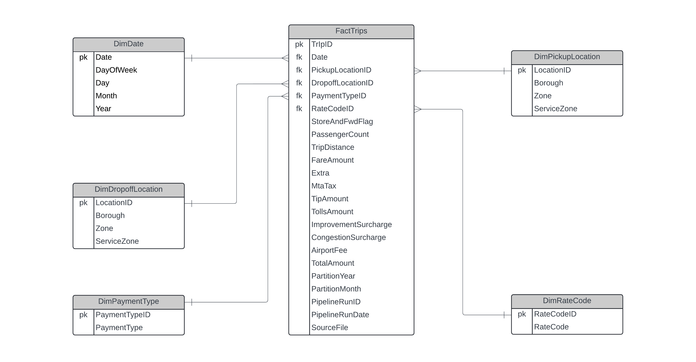

# Lyft Data Lakehouse Pipeline
This project focuses on creating a scalable data pipeline to process and analyze hypothetical Lyft data from the previous two months. The pipeline ingests recent trip records, securely stores the data, and processes it through multiple structured layers to ensure quality and reliability. Once processed, the data is accessible for analytics and insights, supporting data-driven decision-making through dynamic visualizations.

## 📑 Table of Contents
1. [Architecture](#architecture)
2. [Components](#components)
3. [Data Model](#data-model)
4. [Processing Pipeline](#processing-pipeline)
5. [Implementation](#implementation)
   - [Azure Data Lake Storage Gen2](#azure-data-lake-storage-gen2-configuration)
   - [Azure Data Factory](#azure-data-factory-configuration)
   - [Azure Databricks](#azure-databricks-configuration)
   - [Azure Synapse Analytics](#azure-synapse-analytics-configuration)
   - [Power BI](#power-bi-configuration)
7. [Visualization](#visualization)
8. [Notes and Credits](#notes-and-credits)

## Architecture 
This solution is based on the medallion architecture (Bronze, Silver, and Gold layers), optimized for cloud storage and processing using Azure. Databricks is utilized for processing the data through these layers, leveraging Delta Lake to enable efficient data management and ensure data integrity. Below is an outline of the main components:

## Components
- **Orchestatrion:** Azure Data Factory is used to extract data from the [TLC Trip Record Data](https://www.nyc.gov/site/tlc/about/tlc-trip-record-data.page) website and load it into Azure Data Lake Storage Gen2. It sets a variable that allows for the dynamic retrieval of the file containing data from two months prior. Additionally, Data Factory orchestrates the execution of Azure Databricks notebooks, ensuring smooth processing of the data pipeline.
  
- **Storage:** The data is initially stored in Azure Data Lake Storage Gen2, which is then converted into a Delta Lake in the Bronze layer. Each layer (Bronze, Silver, and Gold) has its own partitioning structure by year and month, enabling efficient data management and retrieval.
  
- **Transformation:** Parquet files are first inserted into a Delta Lake in the Bronze layer. The data then undergoes a cleaning transformation in the Silver layer, ensuring data integrity, consistency, and deduplication while adding columns for auditing. Finally, in the Gold layer, star schema tables are created from the cleaned data, with columns renamed for clarity and dimension tables joined to the relevant lookup data.
  
- **Data Lakehouse:** Each layer of the Delta Lake (Bronze, Silver, and Gold) is accessible through serverless SQL pools in Azure Synapse Analytics, serving as a data lakehouse. In the Gold layer, views are built for each dimension table and the fact table to support star schema queries, facilitating efficient data analysis and reporting.
  
- **Visualization:** Power BI connects to the Gold layer views in Synapse to create insightful visualizations for end-users.

## Data Model
The final model in the Gold layer follows a star schema, which facilitates fast queries and optimizes visualization in Power BI. Below is a diagram of the model structure.

## Implementation
### **Azure Data Factory**
Orchestrates the extract, load, and transform (ELT) process in five key activities, briefly explained below. For more technical details, please refer to the [data-factory-pipeline](https://github.com/j-chiesa/lyft-data-lakehouse-pipeline/tree/main/azure-data-factory) directory.
   - *Set Date:* Since the latest data is from two months prior, a variable is set to specify the date of the most recent dataset using the `@addToTime(utcnow(), -2, 'Month')` expression.
     
   - *Extract Trip Data:* Retrieves the data from the NYC TLC website using the previously defined date variable. The data is stored in a designated directory for raw data within the bronze container in Azure Data Lake.
     
   - *Parquet To Delta, Bronze To Silver and Silver To Gold:* Executes Azure Databricks notebooks using an Apache Spark cluster to process and transform the data through each layer.
     

   
### **Azure Data Lake Storage Gen2**
For an overview of Delta Lake and access to all files, please see the [azure-data-lake](https://github.com/j-chiesa/lyft-data-lakehouse-pipeline/tree/main/azure-data-lake) directory.

   
### **Azure Databricks**
The Databricks notebooks contain data transformation processes implemented using PySpark. To view the Databricks notebooks, please go to the [azure-databricks](https://github.com/j-chiesa/lyft-data-lakehouse-pipeline/tree/main/azure-databricks) directory.

### **Azure Synapse Analytics:**
In the Synapse Analytics section, a lakehouse was created utilizing all the Delta Lakes, establishing three serverless SQL pools, one for each layer: Bronze, Silver, and Gold. For detailed queries related to creating the tables, please refer to the [azure-synapse-analytics](https://github.com/j-chiesa/lyft-data-lakehouse-pipeline/tree/main/azure-data-factory) directory.

   
8. **Power BI:** 

### Notes and Credits
